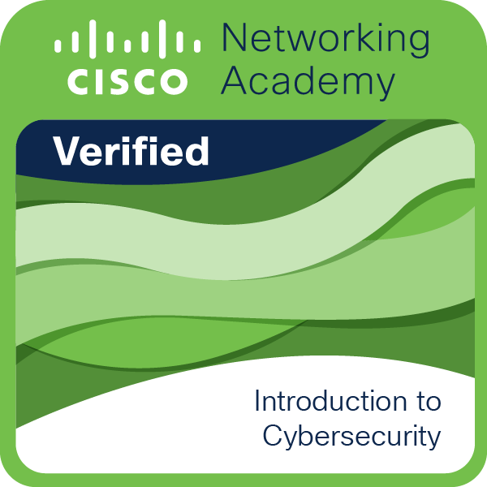
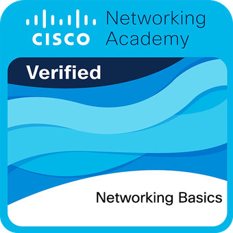

## ¡Hola, soy Oliver Abreu! 👋

🎓 Estudiante de Maestría en Ciberseguridad | 💻 Profesional de TI  
🌐 Apasionado por la protección de sistemas, la tecnología y el aprendizaje continuo.

---

### 🚀 ¿Quién soy?
Soy un profesional dominicano en el área de Tecnologías de la Información, actualmente cursando una Maestría en Ciberseguridad. 
Me especializo en la protección de infraestructuras digitales, análisis de vulnerabilidades y soluciones tecnológicas que aporten valor real a las organizaciones.

---

### 🛠️ Tecnologías y herramientas que manejo:
- Sistemas operativos: Windows, Linux (especialmente Kali)
- Redes: TCP/IP, análisis de tráfico con Wireshark
- Seguridad: Metasploit, Wazuh, OWASP Juice Shop, Snort
- Otros: Git, GitHub, Office, herramientas SIEM, GPOs

---

### 📂 Algunos proyectos en camino:
- ✅ Auditoría de vulnerabilidades con Kali Linux y Metasploitable 2
- ✅ Análisis de tráfico con SOF-ELK y Wireshark
- 🛠️ Configuración de UTM con integración a SIEM
- 🔒 Prácticas de hardening en Windows 11

---

## 🏅 Certificaciones e Insignias

### Cisco Networking Academy

**Introduction to Cybersecurity — 2026**

Curso completado en Cisco Networking Academy, fortaleciendo mis conocimientos fundamentales en ciberseguridad y protección de sistemas.

**Networking Basics — 2026**

Curso completado en Cisco Networking Academy, fortaleciendo mis conocimientos en fundamentos de redes, direccionamiento IP, protocolos y funcionamiento de las comunicaciones de red.

---

### 📫 Conectemos:
- [LinkedIn](https://www.linkedin.com/in/oliver-abreu-081979244/)  
- Correo: **oliverabreu652@gmail.com**

---

_"Mi meta es ser un referente en ciberseguridad, aportar soluciones sólidas, y seguir aprendiendo cada día."_
